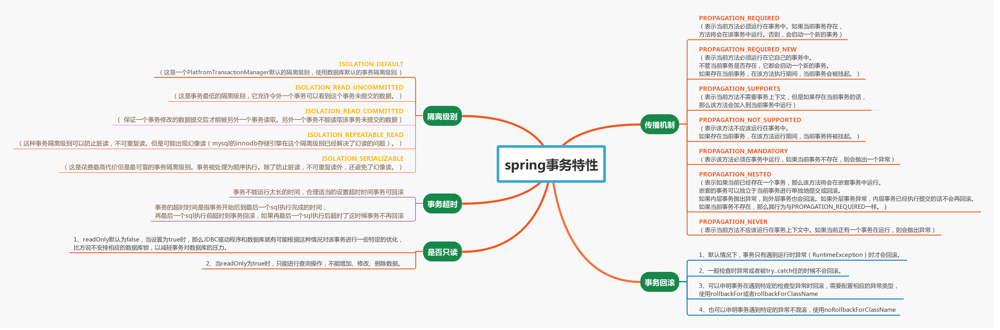

# spring-tx-demo
主要对spring事务做一个复习，各特性用法写测试用例跑一遍，加深理解。
## spring事务特性


### 传播机制
1. PROPAGATION_REQUIRED
  表示当前方法必须运行在事务中。如果当前事务存在，方法将会在该事务中运行。否则，会启动一个新的事务
2. PROPAGATION_REQUIRED_NEW
  表示当前方法必须运行在它自己的事务中。不管当前事务是否存在，它都会启动一个新的事务。如果存在当前事务，在该方法执行期间，当前事务会被挂起。
3. PROPAGATION_SUPPORTS
  表示当前方法不需要事务上下文，但是如果存在当前事务的话，那么该方法会加入到当前事务中运行
4. PROPAGATION_NOT_SUPPORTED
  表示该方法不应该运行在事务中。如果存在当前事务，在该方法运行期间，当前事务将被挂起。
5. PROPAGATION_MANDATORY
  表示该方法必须在事务中运行，如果当前事务不存在，则会抛出一个异常
6. PROPAGATION_NESTED
  表示如果当前已经存在一个事务，那么该方法将会在嵌套事务中运行。嵌套的事务可以独立于当事务进行单独地提交或回滚。如果内层事务抛出异常，则外层事务也会回滚。如果外层事务异常，内层事务已经执行提交的话不会再回滚。如果当前事务不存在，那么其行为与PROPAGATION_REQUIRED一样。
7. PROPAGATION_NEVER
  表示当前方法不应该运行在事务上下文中。如果当前正有一个事务在运行，则会抛出异常

### 隔离级别
1. ISOLATION_DEFAULT
这是一个PlatfromTransactionManager默认的隔离级别，使用数据库默认的事务隔离级别。
2. ISOLATION_READ_UNCOMMITTED
这是事务最低的隔离级别，它充许令外一个事务可以看到这个事务未提交的数据。
3. ISOLATION_READ_COMMITTED
保证一个事务修改的数据提交后才能被另外一个事务读取。另外一个事务不能读取该事务未提交的数据。
4. ISOLATION_REPEATABLE_READ
这种事务隔离级别可以防止脏读，不可重复读。但是可能出现幻像读（mysql的innodb存储引擎在这个隔离级别已经解决了幻读的问题）。
5. ISOLATION_SERIALIZABLE
这是花费最高代价但是最可靠的事务隔离级别。事务被处理为顺序执行。除了防止脏读，不可重复读外，还避免了幻像读。
### 是否只读
1. readOnly默认为false，当设置为true时，那么JDBC驱动程序和数据库就有可能根据这种情况对该事务进行一些特定的优化，比方说不安排相应的数据库锁，以减轻事务对数据库的压力。
2. 当readOnly为true时，只能进行查询操作，不能增加、修改、删除数据。

### 事务超时
1. 事务不能运行太长的时间，合理适当的设置超时时间事务可回滚。
2. 事务的超时时间是指事务开始后到最后一个sql执行完成的时间，再最后一个sql执行前超时则事务回滚，如果再最后一个sql执行后超时了这时候事务不再回滚。
### 事务回滚
1. 默认情况下，事务只有遇到运行时异常（RuntimeException）时才会回滚。
2. 一般检查时异常或者被try...catch住的时候不会回滚。
3. 可以申明事务在遇到特定的检查型异常时回滚，需要配置相应的异常类型，使用rollbackFor或者rollbackForClassName。
4. 也可以申明事务遇到特定的异常不混滚，使用noRollbackForClassName。

## spring事务配置方式及测试用例
### spring事务配置的5种方式
基础配置如下，以下5种事务配置方式依赖此配置：
```xml
<!-- 自动扫描，将带有注解的类纳入spring容器管理 -->
    <context:component-scan base-package="com.star95.study.spring"/>

    <!-- jdbc配置文件 -->
    <bean id="propertyConfigurer" class="org.springframework.beans.factory.config.PropertyPlaceholderConfigurer">
        <property name="locations">
            <list>
                <value>classpath*:jdbc.properties</value>
            </list>
        </property>
    </bean>

    <bean id="dataSource" class="org.apache.commons.dbcp.BasicDataSource">
        <property name="username" value="${jdbc.username}"/>
        <property name="url" value="${jdbc.url}"/>
        <property name="driverClassName" value="${jdbc.driverClassName}"/>
        <property name="password" value="${jdbc.password}"/>
        <property name="initialSize" value="2"/>
        <property name="maxActive" value="5"/>
        <property name="maxWait" value="30000"/>
    </bean>

    <!-- 配置事务管理器 ,管理器需要事务，事务从Connection获得，连接从连接池DataSource获得 -->
    <bean id="txManager" class="org.springframework.jdbc.datasource.DataSourceTransactionManager">
        <property name="dataSource" ref="dataSource"></property>
        <property name="defaultTimeout" value="3000"></property>
        <!--<property name="nestedTransactionAllowed" value="true"></property>-->
    </bean>

    <bean id="jdbcTemplate"
          class="org.springframework.jdbc.core.JdbcTemplate">
        <constructor-arg ref="dataSource"/>
    </bean>
```
1. 每个Bean都有一个代理（基于TransactionProxyFactoryBean代理），基于xml配置
```xml
<bean id="transactionWithSingleTxProxyBean"
          class="org.springframework.transaction.interceptor.TransactionProxyFactoryBean">
        <!-- 配置事务管理器 -->
        <property name="transactionManager" ref="txManager"/>
        <property name="target" ref="transactionWithSingleTxProxy"/>
        <property name="proxyInterfaces" value="com.star95.study.spring.service.UserBalanceService"/>
        <!-- 配置事务属性 -->
        <property name="transactionAttributes">
            <props>
                <prop key="*">PROPAGATION_REQUIRED</prop>
            </props>
        </property>
    </bean>
```

2. 所有Bean共享一个代理基类（基于TransactionProxyFactoryBean代理），基于xml配置
```xml
<bean id="transactionBase"
          class="org.springframework.transaction.interceptor.TransactionProxyFactoryBean"
          lazy-init="true" abstract="true">
        <!-- 配置事务管理器 -->
        <property name="transactionManager" ref="txManager"/>
        <!-- 配置事务属性 -->
        <property name="transactionAttributes">
            <props>
                <prop key="*">PROPAGATION_REQUIRED</prop>
            </props>
        </property>
    </bean>

    <bean id="transactionWithSharedTxProxyBean" parent="transactionBase">
        <property name="target" ref="transactionWithSharedTxProxy"/>
    </bean>
```
3. 使用拦截器
```xml
<bean id="transactionInterceptor"
          class="org.springframework.transaction.interceptor.TransactionInterceptor">
        <property name="transactionManager" ref="txManager"/>
        <!-- 配置事务属性 -->
        <property name="transactionAttributes">
            <props>
                <prop key="*">PROPAGATION_REQUIRED</prop>
            </props>
        </property>
    </bean>

    <bean class="org.springframework.aop.framework.autoproxy.BeanNameAutoProxyCreator">
        <property name="beanNames">
            <list>
                <value>*InterceptorService</value>
            </list>
        </property>
        <property name="interceptorNames">
            <list>
                <value>transactionInterceptor</value>
            </list>
        </property>
    </bean>
```
4. 使用tx标签配置的拦截器(AOP)
```xml
<tx:advice id="txAdvice" transaction-manager="txManager">
        <tx:attributes>
            <!--
                propagation:
                    REQUIRED
                    REQUIRES_NEW
                    SUPPORTS
                    NOT_SUPPORTED
                    MANDATORY
                    NESTED
                    NEVER

                isolation:
                    DEFAULT
                    READ_UNCOMMITTED
                    READ_COMMITTED
                    REPEATABLE_READ
                    SERIALIZABLE
            -->
            <tx:method name="*" propagation="REQUIRED" isolation="DEFAULT"/>
        </tx:attributes>
    </tx:advice>

    <aop:config>
        <aop:advisor advice-ref="txAdvice"
                     pointcut="execution(* com.star95.study.spring.service.impl.TransactionWithAopImpl.*(..))"/>
    </aop:config>
```
5. 全注解(方法或类加@Transactional)
```xml
<tx:annotation-driven transaction-manager="txManager" proxy-target-class="true"/>
```

### 测试用例
1. 事务的几种配置方式的使用见测试用例类：com.star95.study.spring.UserBalanceTransactionTest
2. 事务的传播特性测试用例见测试用例类：com.star95.study.spring.PropagationTest
3. 隔离级别测试用例类：com.star95.study.spring.IsolationTest
4. 事务只读测试用例类：com.star95.study.spring.ReadOnlyTest
5. 事务回滚测试用例类：com.star95.study.spring.RollbackTest
6. 事务超时测试用例类：com.star95.study.spring.TransactionTimeoutTest
